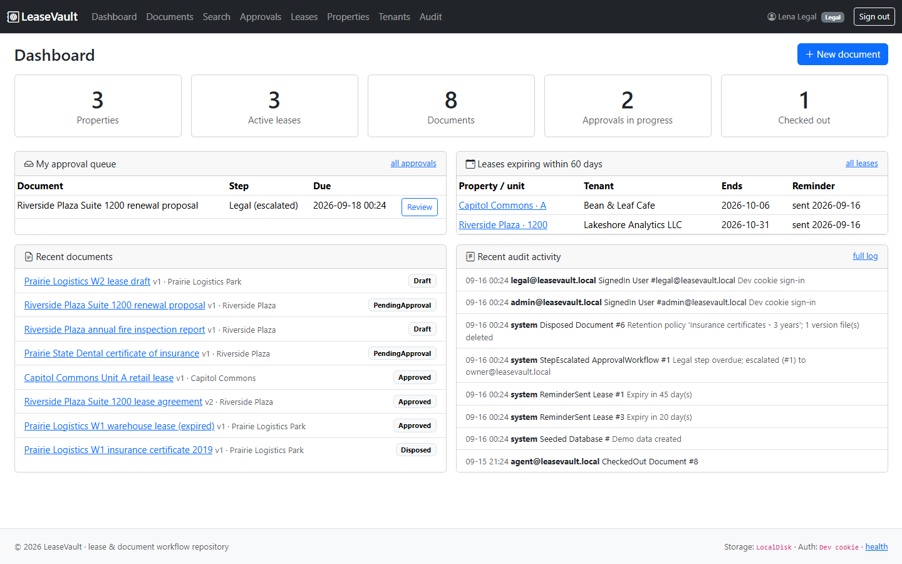
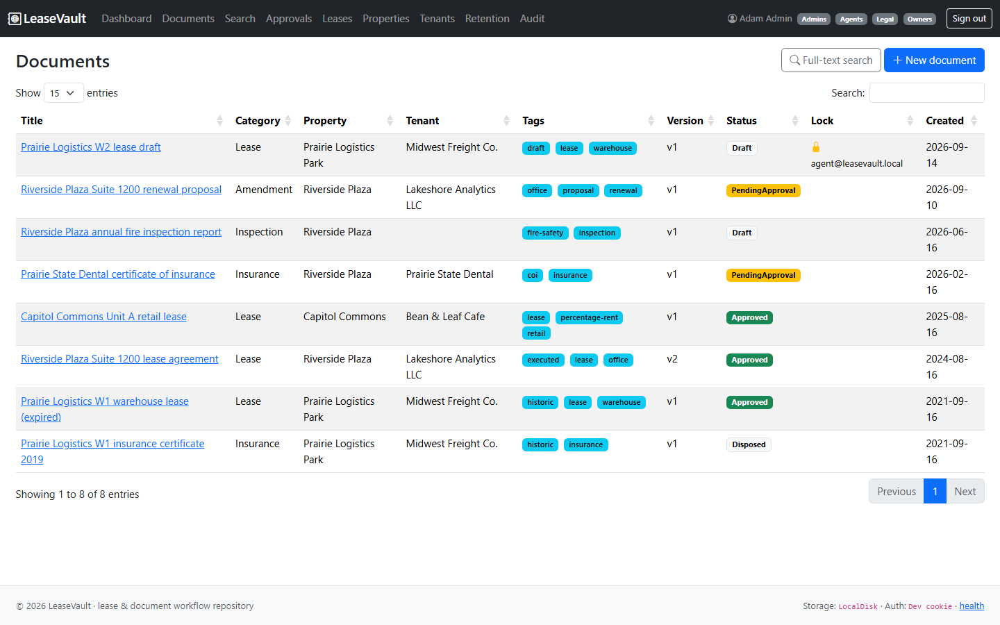
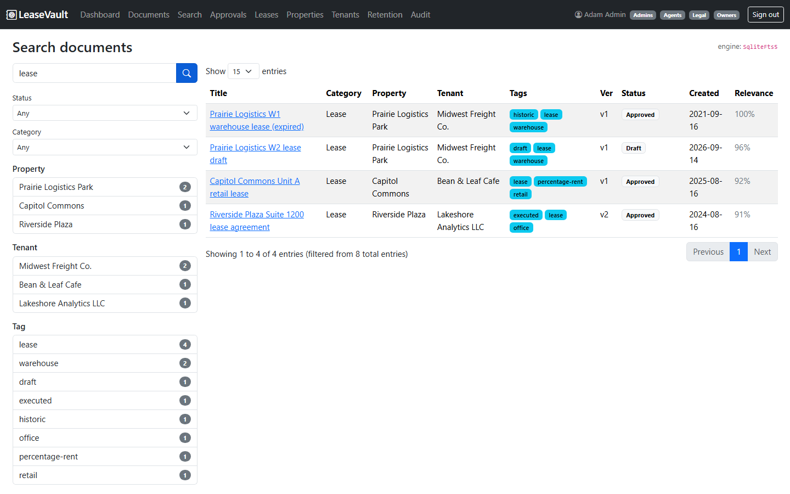
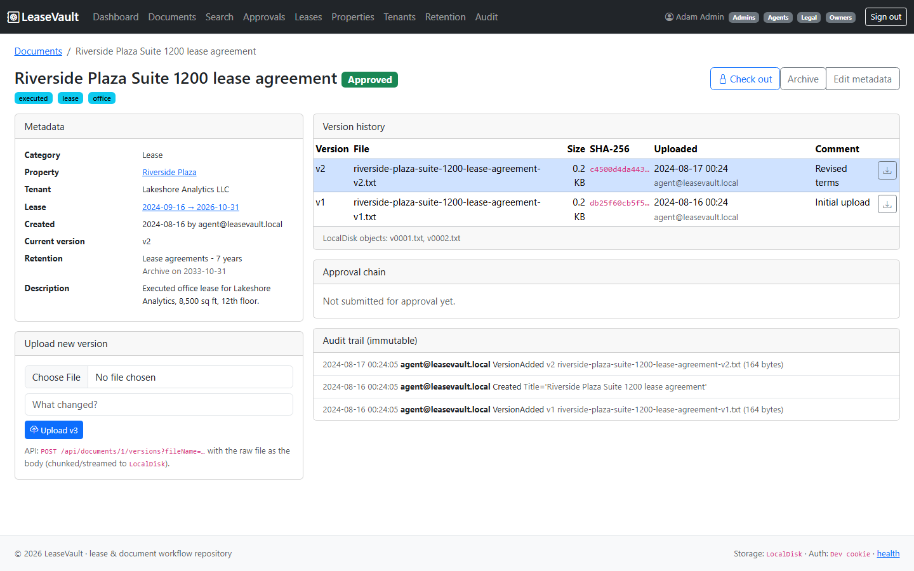
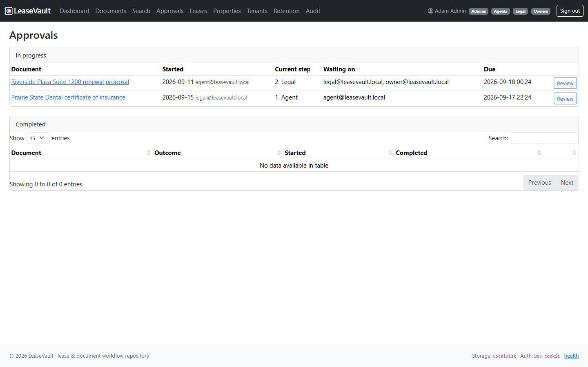
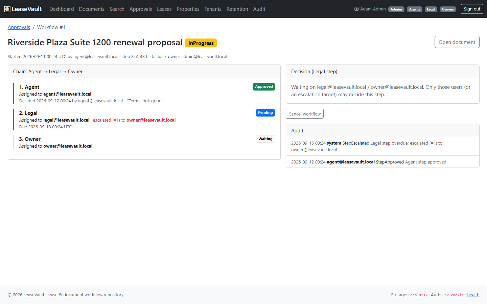
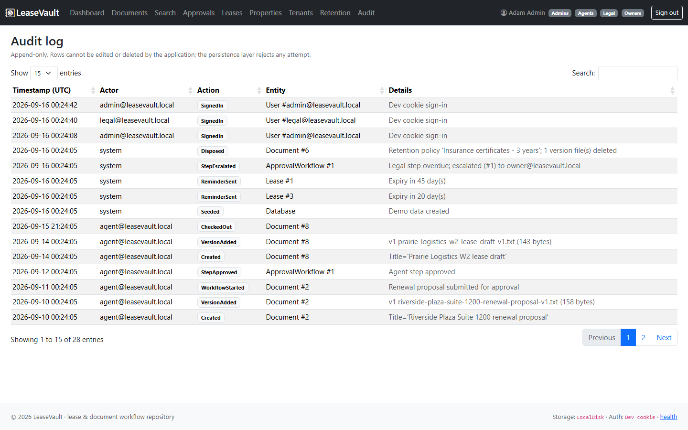

# LeaseVault

[](https://github.com/taminulislam/leasevault/actions/workflows/ci.yml)

LeaseVault is a real-estate lease and document workflow repository. Property agents upload lease
agreements, amendments, insurance certificates and inspection reports against properties, units,
tenants and leases; every file is versioned, can be checked out with a lock, is routed through an
Agent -> Legal -> Owner approval chain with delegation and time-based escalation, and is kept or
disposed of according to retention policies. Full-text search with faceted filters, lease-expiry
reminders and an immutable audit trail make the repository the single source of truth for the
leasing team.

**History:** originally built on ASP.NET Core 2.2 Razor Pages + Web API, EF Core, Azure SQL
full-text search, Azure Blob Storage versioning, Azure Functions, Azure AD SSO with group RBAC,
managed identity, Serilog, App Service custom DNS and Azure DevOps; the code was later upgraded to
.NET 8 (the Functions timers became hosted `BackgroundService`s inside the web app).

## Live demo

[](https://codespaces.new/taminulislam/leasevault?quickstart=1)

Launch a Codespace, then run:

```bash
dotnet run --project src/LeaseVault.Web --urls http://localhost:5107
```

Open the forwarded port 5107 and sign in with `admin@leasevault.local` / `Passw0rd!` (the other
seeded accounts are listed under [Run locally](#run-locally)). The demo runs entirely on SQLite
with seeded demo data and documents stored on local disk - no Azure subscription, SQL Server,
storage account or Entra tenant is required.

## Screenshots

### Dashboard
Portfolio counters, the signed-in user's approval queue, leases entering the expiry window and
recent audit activity.



### Document library
Every document with its property, tenant, tags, current version, workflow status and check-out
lock, in a DataTables grid.



### Faceted full-text search
SQLite FTS5 (or SQL Server full-text) results with facet counts by property, tenant, tag and
status, plus a relevance score per hit.



### Document detail and version history
Immutable versions with SHA-256 and size per revision, the resolved retention policy and disposal
date, and the upload/check-out controls.



### Approvals queue
Workflows in progress with the current step, who it is waiting on and overdue highlighting.



### Approval chain
The Agent -> Legal -> Owner chain for one document - here the Legal step has passed its SLA and the
background service has escalated it to the Owner.



### Immutable audit log
Append-only trail of every create, version upload, check-out, approval, escalation, reminder and
retention disposal.



## Architecture

```
LeaseVault.sln
├── src/LeaseVault.Core            domain model + business rules, no dependencies
├── src/LeaseVault.Infrastructure  EF Core, storage, search, e-mail, services, hosted services
├── src/LeaseVault.Web             Razor Pages UI, minimal API, auth, Serilog, health checks
├── tests/LeaseVault.Tests         xUnit: domain, infrastructure (SQLite) and integration tests
├── db/fulltext.sql                SQL Server full-text catalog + index
├── infra/main.bicep               App Service + slot, Azure SQL, Storage, Key Vault, App Insights
├── azure-pipelines.yml            Build -> Test -> staging slot -> swap to production
├── docs/                          ARCHITECTURE, DEPLOYMENT, CHANGE_MANAGEMENT, screenshots/
└── .devcontainer/                one-click GitHub Codespaces demo
```

* **Core** holds the aggregates (`Document`, `Lease`, `ApprovalWorkflow`, ...) and the rules:
  check-out/check-in with lock owner, immutable version numbering, the approval chain with
  delegation/escalation, lease-expiry windows and `RetentionCalculator`.
* **Infrastructure** implements the abstractions declared in Core: `IDocumentStorage`
  (Azure Blob block upload with version listing, or local disk), `ISearchService`
  (SQL Server `CONTAINS`/`FREETEXT`, or SQLite FTS5 with a `LIKE` fallback), `IEmailSender`,
  `IAuditLog` (append-only, enforced by the `DbContext`), plus the three background services.
* **Web** wires everything with configuration-driven provider selection, group-based
  authorization policies and a DataTables-powered search grid.

See [docs/ARCHITECTURE.md](docs/ARCHITECTURE.md) for the component and data-model diagrams.

## Features

- Properties, units, tenants and leases with list / detail / create / edit screens
- Documents with metadata tags, categories, version history and SHA-256 integrity per version
- Check-out / check-in locks (administrators can break a lock); uploads blocked for other users
- Chunked upload API that streams the request body into Azure Blob block uploads
- Approval chain Agent -> Legal -> Owner with comments, delegation, cancellation and SLA-based
  escalation to the next approver, then the Owner, then a fallback owner
- E-mail notifications through `IEmailSender` (console/log implementation included)
- Lease-expiry reminders (`LeaseExpiryReminderService`, configurable lead days) that also move
  leases to *Expiring* / *Expired*
- Retention policies per category with archive or delete actions, legal hold and a daily sweep
- Full-text search (SQL Server full-text or SQLite FTS5) with facets by property, tenant, tag and
  status rendered in a DataTables grid
- Immutable audit log for every create, update, lock, version, download, approval and sweep
- Entra ID single sign-on with group RBAC (Agents, Legal, Owners, Admins) and a development
  cookie login when no tenant is configured
- Health endpoint `/health`, Serilog structured logging, Docker image, Bicep infrastructure

## Tech stack

.NET 8 - ASP.NET Core Razor Pages + minimal APIs - EF Core 8 (SQL Server / SQLite) - Azure Blob
Storage SDK 12 - Azure.Identity (`DefaultAzureCredential`) - Microsoft.Identity.Web - Serilog -
Bootstrap 5, jQuery and DataTables (CDN) - xUnit + `WebApplicationFactory` - Azure DevOps YAML
pipelines - GitHub Actions - Bicep - Docker

## Run locally

Requirements: .NET 8 SDK. No SQL Server, storage account or Entra tenant needed.

```bash
cd src/LeaseVault.Web
dotnet run
```

Open the printed URL (for example `http://localhost:5072`). The app creates `app.db` (SQLite),
builds the FTS5 index, stores files under `App_Data/storage` and seeds three properties, five
leases, eight documents, retention policies and two approval workflows.

Sign in with one of the seeded development users (password `Passw0rd!`):

| User | Groups | Can |
|------|--------|-----|
| `agent@leasevault.local` | Agents | create/edit records, upload, check out, submit for approval, approve Agent step |
| `legal@leasevault.local` | Legal | approve Legal step, download, search |
| `owner@leasevault.local` | Owners | approve Owner step, download, search |
| `admin@leasevault.local` | Admins (all) | everything, break locks, manage retention, run sweeps |

To use SQL Server, Azure Blob Storage or Entra ID set the corresponding values (user secrets,
environment variables or Key Vault):

```bash
dotnet user-secrets set "ConnectionStrings:Default" "Server=...;Database=LeaseVault;..."
dotnet user-secrets set "Storage:AccountUri" "https://stleasevault.blob.core.windows.net"
dotnet user-secrets set "AzureAd:TenantId" "<tenant>"
dotnet user-secrets set "AzureAd:ClientId" "<app registration>"
```

After pointing at SQL Server run `db/fulltext.sql` once to create the full-text catalog
(the app also tries to create it at start-up when it has permission).

### API examples

```bash
# upload a new version (raw body, streamed into block blobs)
curl -b cookies.txt -X POST --data-binary @lease.pdf -H "Content-Type: application/pdf" \
  "http://localhost:5072/api/documents/1/versions?fileName=lease.pdf&comment=Executed+copy"

# download version 2
curl -b cookies.txt -o lease-v2.pdf http://localhost:5072/api/documents/1/versions/2

# lock / unlock
curl -b cookies.txt -X POST http://localhost:5072/api/documents/1/checkout
curl -b cookies.txt -X POST http://localhost:5072/api/documents/1/checkin

# faceted search (DataTables server-side shape)
curl -b cookies.txt "http://localhost:5072/api/search?q=lease+renewal&tag=office&length=10"
```

## Run tests

```bash
dotnet test
```

The suite (70 tests) covers the approval chain rules, check-in/out and version rules, lease-expiry
windows, retention calculation and sweep, audit immutability, local storage, SQLite FTS5 search
including the `LIKE` fallback, escalation and reminder services, and end-to-end API tests against
the real host with SQLite in-memory (`WebApplicationFactory`).

## CI/CD

* **GitHub Actions** (`.github/workflows/ci.yml`) builds with warnings as errors, runs the tests
  and builds the Docker image on every push and pull request.
* **Azure DevOps** (`azure-pipelines.yml`) is a four-stage pipeline: *Build* publishes the web
  artifact plus the infra and SQL scripts; *Test* runs xUnit with coverage; *DeployDev* deploys
  `main` builds to the App Service `staging` slot (environment `dev`) and smoke-tests `/health`;
  *DeployProd* swaps staging into production (environment `prod`, manual approval) and smoke-tests
  again. Rollback is a reverse swap - see [docs/CHANGE_MANAGEMENT.md](docs/CHANGE_MANAGEMENT.md).
* Secrets never live in the repo: connection strings and the Entra client secret are Key Vault
  references resolved through the web app's system-assigned managed identity, and blob access uses
  the same identity. Details in [docs/DEPLOYMENT.md](docs/DEPLOYMENT.md).

## License

Internal project - all rights reserved.
