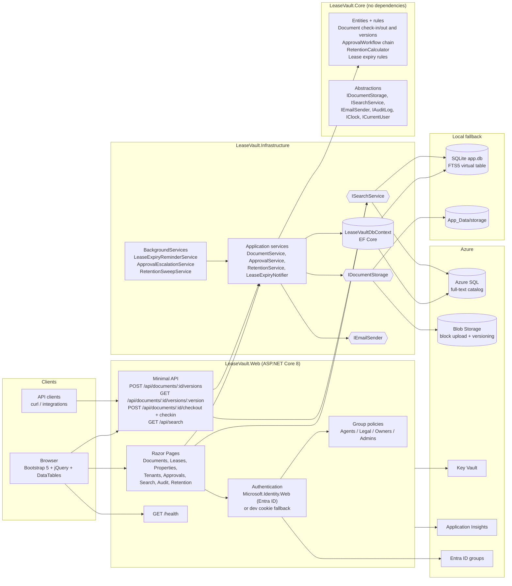
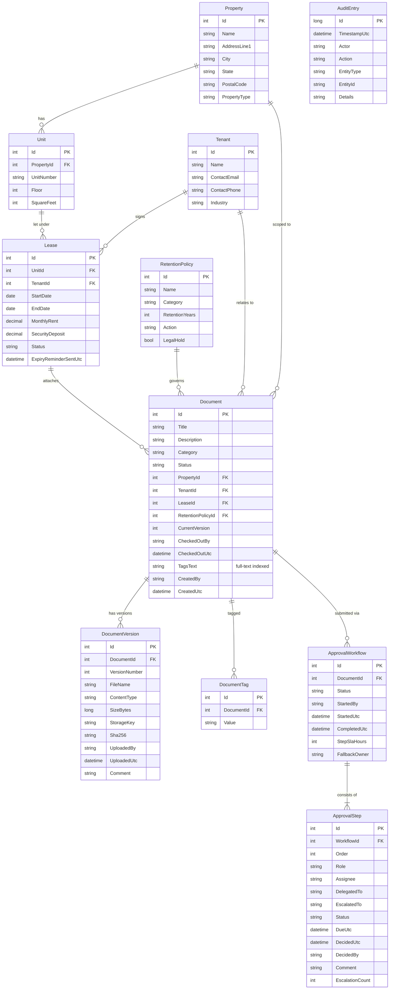

# LeaseVault architecture

LeaseVault is a three-project .NET 8 solution: a Razor Pages/minimal API host, an infrastructure
library (EF Core, storage, search, hosted services) and a dependency-free core library that holds
the domain model and every business rule.

## Component diagram

### Layering rules

| Layer | May reference | Responsibilities |
|-------|---------------|------------------|
| `LeaseVault.Core` | nothing | Entities, enums, domain exceptions, approval chain, check-in/out, version and retention rules, abstractions |
| `LeaseVault.Infrastructure` | Core | EF Core model + seeding, `EfAuditLog`, Azure Blob / local disk storage, SQL Server / SQLite search, e-mail, application services, hosted services, DI wiring |
| `LeaseVault.Web` | Core, Infrastructure | Razor Pages, minimal API endpoints, authentication/authorization, Serilog, health checks |
| `LeaseVault.Tests` | all | Domain rule tests, infrastructure tests on SQLite in-memory, `WebApplicationFactory` integration tests |

## Provider selection

Everything environment-specific is chosen from configuration at start-up
(`ServiceCollectionExtensions.AddLeaseVaultInfrastructure`):

| Concern | Configuration | Azure implementation | Local fallback |
|---------|---------------|----------------------|----------------|
| Database | `ConnectionStrings:Default` | `UseSqlServer` (Azure SQL) | `UseSqlite("Data Source=app.db")` |
| Search | derived from provider | `SqlServerFullTextSearchService` (`CONTAINSTABLE` / `FREETEXTTABLE`) | `SqliteFtsSearchService` (FTS5 `DocumentSearch` virtual table with sync triggers; `LIKE` if FTS5 is missing) |
| Document content | `Storage:AccountUri` / `Storage:ConnectionString` | `AzureBlobDocumentStorage` (staged blocks + `CommitBlockList`, blob versioning listed via `VersionId`, `DefaultAzureCredential`) | `LocalDiskDocumentStorage` |
| Identity | `AzureAd:ClientId` | Microsoft.Identity.Web OpenID Connect + `EntraGroupClaimsTransformation` | Cookie login with `DevUserDirectory` |
| E-mail | (extension point) | SMTP/SendGrid via `IEmailSender` | `LoggingEmailSender` |

## Request flows

### Upload a version (chunked)

1. `POST /api/documents/{id}/versions` (raw body or multipart) is authorised by the
   `RequireContributor` policy.
2. `DocumentService.AddVersionAsync` loads the aggregate and calls `Document.EnsureCanAddVersion`
   *before* reading the body, so a locked or archived document fails fast.
3. The request stream is handed to `IDocumentStorage.UploadAsync`. The blob implementation stages
   4 MiB blocks and commits the block list; SHA-256 and size are computed on the fly.
4. `Document.AddVersion` applies the rules (lock owner, duplicate hash, empty content, approved ->
   draft) and appends an immutable `DocumentVersion`.
5. `EfAuditLog` appends an `AuditEntry` in the same `SaveChanges`.

### Approval chain

`ApprovalWorkflow.Start` builds the fixed Agent -> Legal -> Owner steps, activates the first and
stamps a due date from the configurable SLA. `Approve` / `Reject` / `Delegate` enforce that only the
step's assignee, delegate or escalation target may decide. `ApprovalEscalationService` runs
`ApprovalService.EscalateOverdueAsync` on an interval; an overdue step is escalated to the next
role's assignee, then the Owner, then the configured fallback owner, with a fresh SLA each time.

## Data model

`AuditEntry` has no relationships on purpose: it is an append-only ledger keyed by entity type and
id, and `LeaseVaultDbContext` throws if any code path tries to update or delete a row (the same
guard makes `DocumentVersion` rows immutable).

## Search index

* **SQL Server** - `db/fulltext.sql` creates `LeaseVaultCatalog` and a full-text index over
  `Documents(Title, Description, TagsText)` with automatic change tracking. Queries use
  `CONTAINSTABLE` with quoted prefix terms joined by `AND`, then relax to `FREETEXTTABLE`.
* **SQLite** - `SqliteFtsSearchService.EnsureIndexAsync` creates the `DocumentSearch` FTS5 table
  (porter + unicode61 tokenizer) and `AFTER INSERT/UPDATE/DELETE` triggers on `Documents`, then
  back-fills existing rows. Ranking uses `bm25()`. When the SQLite build lacks FTS5 the service
  reports `SqliteLike` and scans with `LIKE`.

Both providers share `SearchServiceBase`, which applies the facet filters (property, tenant, tag,
status, category), computes facet counts over the matched set and pages the results for the
DataTables grid.
